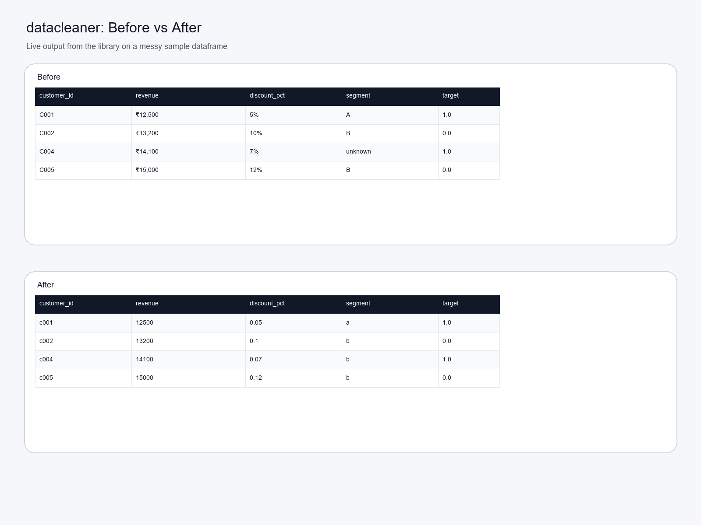
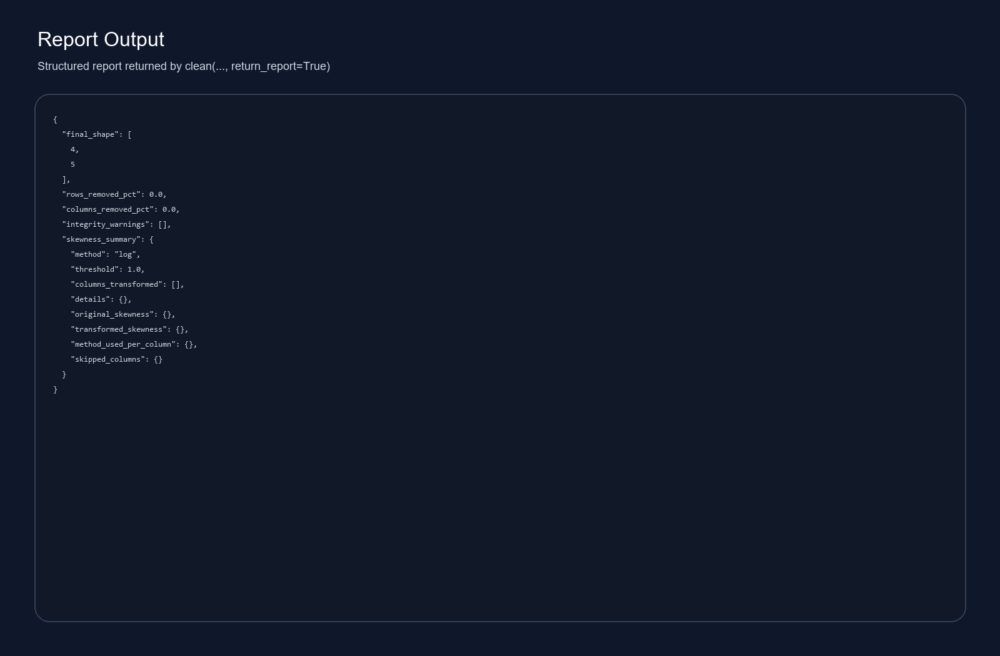
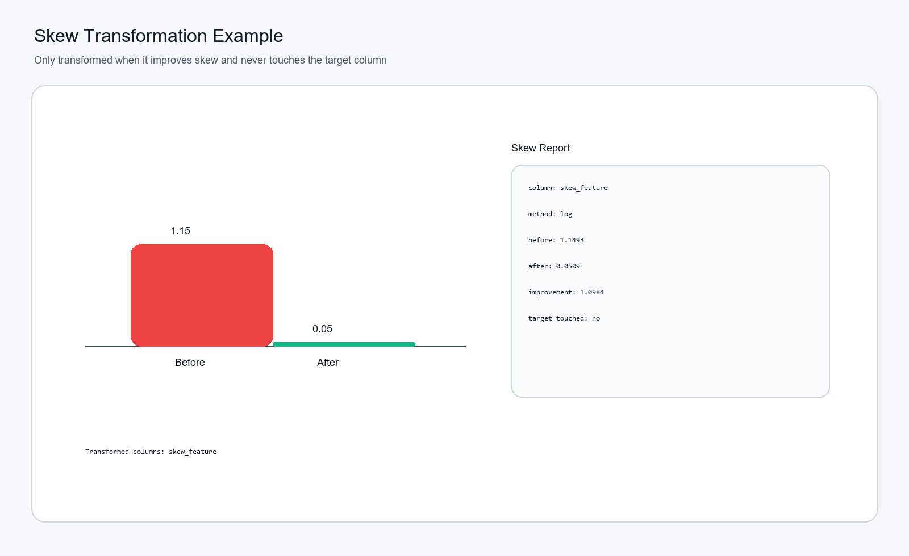

# datacleaner

ML-safe data cleaning library for real-world datasets.

## 🚀 Overview

A production-grade Python library that cleans messy datasets using safe, explainable defaults.

- Prevents over-cleaning
- Preserves target column
- Provides transparent transformations
- Tested on 50 datasets

## 🔥 Key Features

- Full cleaning pipeline
- Target column NEVER modified in clean()
- Explicit target handling via handle_target()
- Smart datatype conversion (₹, %, commas)
- Outlier handling with safeguards
- Skewness handling (only when beneficial)
- Conservative column selection (no aggressive drops)
- Correlation reduction (no cascade deletion)
- Safety guards (row/column loss control)
- Detailed report output
- Validated on 50 datasets

## 📦 Installation

```bash
pip install datacleanr
```

Package name on PyPI: datacleanr

Import name in code: datacleaner

## ⚡ Quick Example

```python
from datacleaner import clean, handle_target

df, target_report = handle_target(df, "target", strategy="auto")

cleaned_df, report = clean(df, target_column="target", return_report=True)
```

## 🎯 Target Handling

## 🎯 Target Handling (IMPORTANT)

The `clean()` function **never modifies the target column**.

This is intentional to ensure:

- no label corruption
- safe usage in ML pipelines
- predictable behavior

### Why?

In real-world ML workflows:

- filling or modifying target values can introduce bias
- automatic changes to labels are unsafe

### How to handle target values?

Use the dedicated function:

```python
from datacleaner import handle_target

df, target_report = handle_target(df, "target", strategy="auto")
```

### Behavior:

- If missing values are small -> optional fill (controlled)
- If missing values are large -> rows are dropped
- Fully transparent (reports actions taken)

### ⚠️ Important

If you skip `handle_target()`:

- target column will remain unchanged
- missing values in target will NOT be handled

This design ensures full user control over label processing.

## 📊 Skew Handling

- Applied ONLY when it improves distribution
- Safe for negative values
- Never applied to target
- Fully transparent

Example:

```json
{
    "feature": {
        "before": 1.14,
        "after": 0.05,
        "method": "log"
    }
}
```

## 🧠 Feature Selection

- Avoids dropping useful columns
- Prevents cascade correlation deletion
- Keeps column loss controlled, with validation showing no dataset above 25% clean-stage column loss

## 📈 Validation (IMPORTANT)

- Tested on 50 datasets
- Real datasets + synthetic + edge cases
- 0 failures
- 0 target corruption
- Stable across all scenarios

Validation artifact: [tests/validation_50_results.json](tests/validation_50_results.json)

## 📷 Screenshots





## 📄 Report Example

```json
{
    "final_shape": [rows, columns],
    "rows_removed_pct": 2.5,
    "columns_removed_pct": 8.3,
    "integrity_warnings": [],
    "skewness_summary": {
        "columns_transformed": ["feature_x"],
        "details": {
            "feature_x": {
                "before": 1.14,
                "after": 0.05,
                "method": "log"
            }
        }
    }
}
```

## ⚙️ Design Philosophy

- Conservative over aggressive
- Transparency over automation
- Safety over convenience

## 🏷 Version

v0.1.3

## License

MIT License. See LICENSE.
